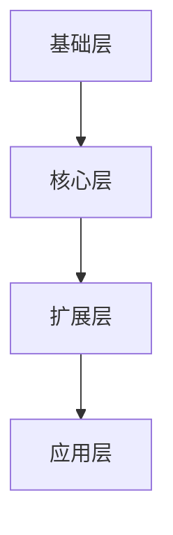
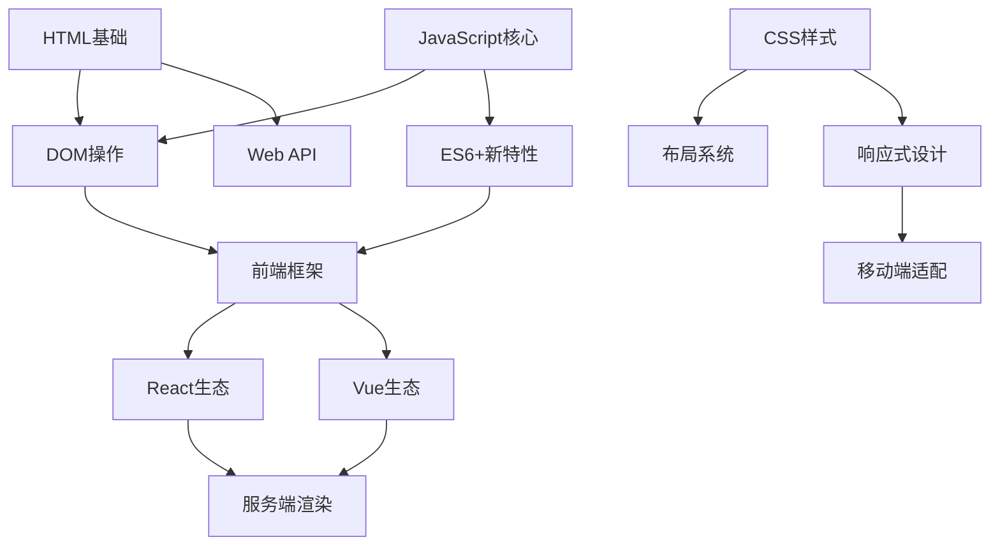
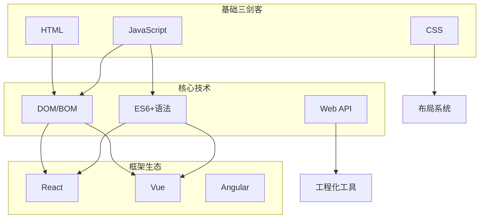

# 知识点地图生成器

将分散的知识点转化为结构化、可视化的知识地图，帮助用户理解知识体系的全貌和内在联系。

## 工作流程

### 1. 接收用户输入

用户提供知识体系的方式可能包括：
- 列出知识点名称（如"HTML, CSS, JavaScript, React, Vue"）
- 描述学习目标或领域（如"前端开发"、"机器学习入门"）
- 提供现有课程大纲或目录结构
- 指定特定教材/考试的章节安排

### 2. 分析知识结构

基于输入，识别以下要素：

**层级关系**：
- 基础层（前置知识、入门概念）
- 核心层（主干知识、必备技能）
- 扩展层（进阶内容、细分领域）
- 应用层（实践场景、综合项目）

**关联类型**：
- 依赖关系（A是B的前提）
- 并列关系（同级概念，可并行学习）
- 包含关系（A包含B、C）
- 递进关系（从A到B是进阶）

### 3. 生成可视化输出

每个知识地图包含三部分：

#### A. 层级结构图（Mermaid 流程图）

展示知识的纵向层次：



#### B. 知识点关系图（Mermaid 图）

展示知识的横向联系：

- 简单体系（<10节点）：使用 `graph LR` 或 `graph TD`
- 复杂体系（≥10节点）：使用 `flowchart` 并分组
- 强调依赖路径：使用 `graph LR` 配合箭头样式

#### C. 关联分析说明

文字解释关键联系：
- 学习顺序建议
- 核心节点说明
- 分支选择指南

## 输出格式规范

### Mermaid 图表规则

1. **节点命名**：使用简短标识符（如 `html`, `css`, `js`）
2. **节点文本**：使用中文描述（如 `HTML基础`, `CSS样式`, `JavaScript核心`）
3. **箭头含义**：
   - `A --> B`：A是B的前置知识
   - `A -.-> B`：A与B有关联但非必须
   - `A ==> B`：强烈建议的顺序
4. **样式区分**：
   - 核心节点：`style A fill:#e1f5fe`
   - 基础节点：`style B fill:#f1f8e9`
   - 进阶节点：`style C fill:#fff3e0`

### 文字说明结构

```markdown
## 知识体系概览

[1-2句总体描述]

## 层级结构

### Level 1: 基础层
- 知识点列表
- 学习时长建议

### Level 2: 核心层
...

## 关联分析

### 核心路径
[描述最主要的学习路径]

### 分支选择
[描述可选的扩展方向]

### 学习建议
[具体的行动建议]
```

## 示例：前端开发知识体系

用户输入："帮我整理前端开发的知识体系地图，包括HTML/CSS/JS的关系"

输出结构：

### 层级结构图



### 知识点关系图



### 关联分析

**核心学习路径**：
1. 基础三剑客（HTML → CSS → JS）可并行学习
2. JS掌握后学习DOM操作，是框架的基础
3. ES6+是现代框架的必备前提

**分支选择建议**：
- 工程化方向：Webpack/Vite + TypeScript
- 全栈方向：Node.js + 数据库
- 移动端：React Native / Flutter

**学习时长参考**：
- 基础层：2-4周
- 核心层：4-8周
- 框架层：4-6周/每个

## 注意事项

1. **复杂度控制**：超过20个节点时，考虑分模块展示或使用子图
2. **准确性优先**：不确定的关系用虚线表示，或询问用户确认
3. **保持更新**：技术领域知识变化快，标注版本信息（如"ES2023"）
4. **响应用户需求**：如果用户指定特定教材/考试，优先遵循其结构
